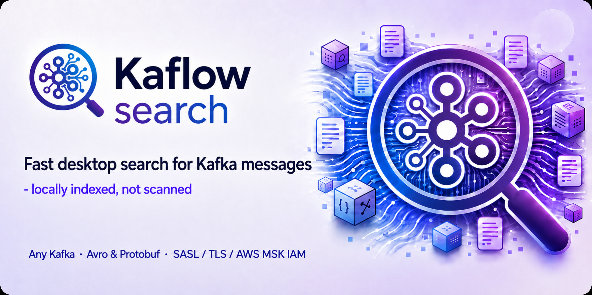
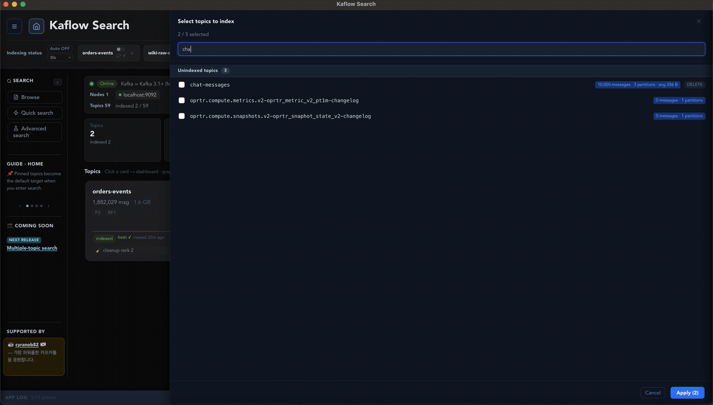
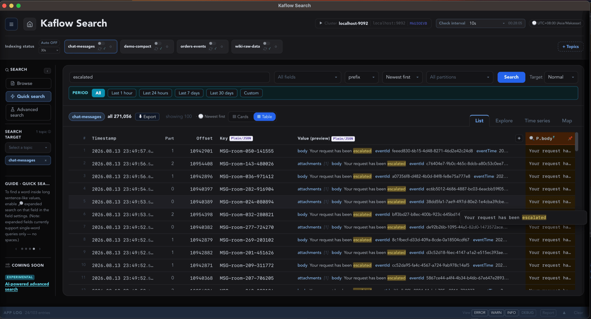
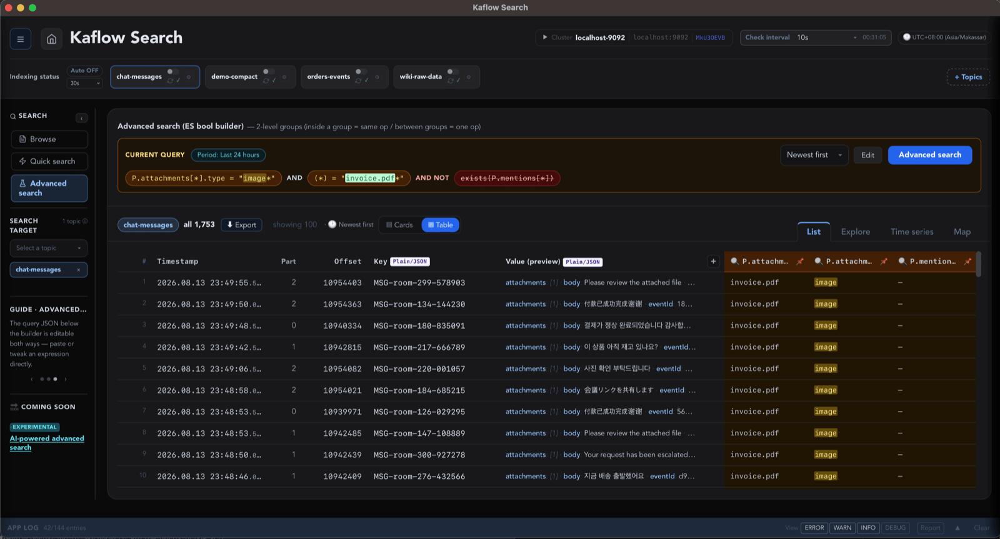
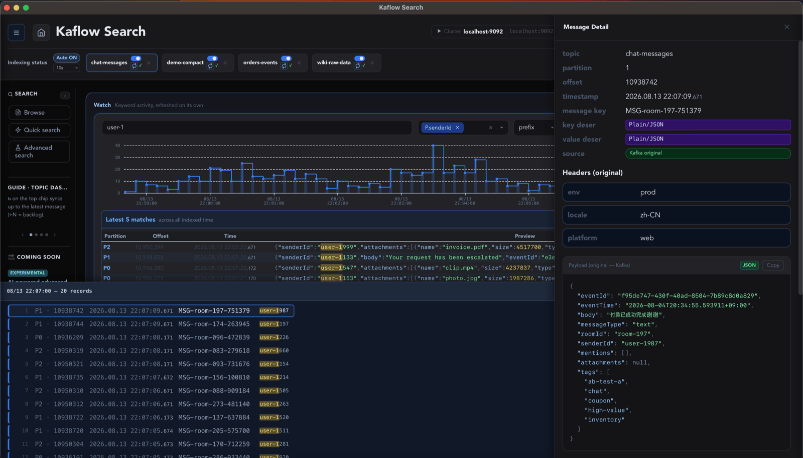

<p align="right">
<b>Open Beta</b> &nbsp;&nbsp;&nbsp;&nbsp;
<a href="README.md"><kbd>English</kbd></a> &nbsp; <a href="README.ko.md"><kbd>한국어</kbd></a> &nbsp; <a href="README.ja.md"><kbd>日本語</kbd></a> &nbsp; <kbd><b>中文</b></kbd>
</p>

<div align="center">

<!-- Chinese banner variant is not ready yet; the English one is used here for now, which
     is the more reason to keep the tagline below in text. The wordmark is in the banner,
     so the title is not repeated. Structure follows README.md. -->


### 面向 Kafka 消息的桌面搜索引擎

**在数百万条消息中找到那一条 —— 只需几秒，全程在你自己的机器上。**

`本地索引` · `无需额外基础设施` · `无需注册` · `数据不出本机`

**[⬇ 下载](#下载)** · **[网站](https://kaflow-search.whsoul-tools.com/)** · **[安装指南](#安装)** · [Issues](https://github.com/whsoul/kaflow-search/issues)

</div>

---

## 能做什么

|  |  |
|---|---|
| 🔎 **是检索，不是扫描** | 在数百万行索引上做关键词或字段检索，几秒出结果 |
| 🧩 **组合条件** | 对 key、header 和嵌套 JSON 字段使用 `AND` / `OR` / `NOT` |
| 🕒 **按时间收窄** | 指定精确时间范围，或从时序图下钻 |
| 👁 **监视关键词** | 锁定一个关键词，开着即可 —— 图表会自动前进 |
| 🧬 **解码 payload** | JSON · Avro · Protobuf —— 本地 schema 或 Confluent Schema Registry |
| 📤 **导出结果** | JSONL / CSV / TSV，可选 gzip 或 zstd |
| 🔐 **连接你所在的环境** | **AWS MSK (IAM)** · SASL/SCRAM · SSL/TLS · Confluent Schema Registry |
| 🔌 **离线可用** | 集群连不上时，已建索引的数据照样能搜 |

 数百万行几秒出结果 · 检索时不会重新读取 Kafka

 一个桌面应用 · 无需服务端、连接器或数据库 · 在你设定的上限内自动清理

 嵌套 JSON 与 header 条件 · AND/OR/NOT · 时序下钻 · Avro/Protobuf · 可连接 AWS MSK 等托管集群

 装在你自己的机器上，而非云服务 · 消息不会离开本机 · 从不保存密码

 只读，而且只在建索引和同步时读取。此后反复检索都不会向集群发起任何请求

---

## 演示

<div align="center">
  
</div>

<!-- Video is a GitHub attachment, not a repo file. -->
<div align="center">
  <sub><a href="https://github.com/user-attachments/assets/aee0fc7e-2f7e-484c-bf23-de6455bf9af9">▶ 观看完整演示 (3 分钟)</a> —— 每个步骤，按真实速度</sub>
</div>

<table>
  <tr>
    <td width="33%"><br/><sub><b>检索结果</b></sub></td>
    <td width="33%"><br/><sub><b>组合条件</b></sub></td>
    <td width="33%"><br/><sub><b>消息详情</b></sub></td>
  </tr>
</table>

---

## 下载

| 操作系统 | 架构 | 文件 |
|---|---|---|
| macOS | Apple Silicon | `.dmg` |
| macOS | Intel | `.dmg` |
| Windows | x64 | [`.exe` / `.msi`](https://github.com/whsoul/kaflow-search/releases/latest) |
| Linux | — | 需求足够就会提供 —— [投上一票](https://github.com/whsoul/kaflow-search/issues/6) |

**[⬇ 获取最新版本](https://github.com/whsoul/kaflow-search/releases/latest)** —— 请只从这里下载。

**运行要求** —— macOS 11 (Big Sur) 及以上，或 Windows 10 及以上 (x64) · Apache Kafka 2.4 及以上（[支持哪些环境](#支持的环境)）

| | |
|---|---|
| **大小** | 下载 75–85 MB，安装后约 105 MB |
| **可用空间** | **在此之外**，本地索引每个集群需预留 **10 GB 以上**（两个集群即 20 GB 以上）。索引上限可在设置中调整 |
| **磁盘类型** | **建议使用 SSD。** 建索引写入量大，机械硬盘也能用，但会明显变慢 |

无需另行准备数据库或后台服务。

> 🔔 **想知道新版本什么时候发布？** 用本仓库顶部的 **[Watch ▾] → Custom → ☑ Releases**，
> 每次发布都会收到通知 —— 如果你在等某个还在开发中的平台，这会很方便。

## 安装

> ### ⚠️ 系统会弹出警告，这是预期之中的。
>
> Kaflow Search **尚未在 Apple 或 Microsoft 完成开发者认证** —— 那需要付费证书，本项目还没有购买。
> 因此系统会把它标记为「来自身份不明的开发者」。这**并不表示**其中发现了任何有害内容。
> 按下面的步骤**允许一次**，之后就能正常运行。
>
> *（如果你愿意，也可以[核对下载的文件是否被篡改](#数据与安全)。这不是必需的。）*


<details open>
<summary><b>macOS</b> —— 系统设置 →「仍要打开」</summary>

1. 打开 `.dmg`，把 **Kaflow Search** 拖到「应用程序」文件夹。

   > 💡 **不要直接在 DMG 里启动。** 先移动出来，再从「应用程序」启动，否则你会把授权流程走两遍。
   > （授权只对单个文件生效，所以给 DMG 里的那份授权，并不会带到你复制出来的那份上。）

2. 从「应用程序」启动。出现下面的提示时点**好**：

   > `无法打开“Kaflow Search”，因为 Apple 无法检查其是否包含恶意软件。`

3. 打开**系统设置 → 隐私与安全性**，在**安全性**一栏点击**［仍要打开］**，并在随后的对话框中再确认一次。

   > `已阻止使用“Kaflow Search”，因为它来自身份不明的开发者。`

   *（该按钮只在第 2 步被阻止**之后**才会出现。如果没看到，请再启动一次应用。）*

**有些环境会问两次** —— 安装后一次，首次启动时一次。这不是出错，按同样方式再允许一次即可，之后不会再问。

<br/>

**如果想省去这些步骤**，可以改为在终端里执行一次下面的命令，然后照常打开应用：

```bash
xattr -dr com.apple.quarantine "/Applications/Kaflow Search.app"
```

*（每个安装版本执行一次即可。提示文案会因 macOS 版本略有差异。）*

</details>

<details open>
<summary><b>Windows</b> —— 遇到“未知发布者”警告时继续安装</summary>

安装时，Windows 可能会显示“未知发布者”或 Microsoft Defender SmartScreen 警告。
与 macOS 相同，这是因为 Kaflow Search 尚未使用付费代码签名证书，**并不表示**系统发现了有害内容。
请选择**更多信息 → 仍要运行**以继续安装。

从 v0.1.3 开始，Microsoft Visual C++ 运行库已链接到应用中，无需单独安装。如果仍在使用
v0.1.2 Windows Preview 且应用启动后立即退出，请更新到最新版本。如果必须继续使用该预览版，
可以安装 [Microsoft Visual C++ Redistributable (x64)](https://aka.ms/vs/17/release/vc_redist.x64.exe)。
旧版本的运行库问题可能会在 Windows 事件查看器中显示为 `MSVCP140.dll`、`VCRUNTIME140.dll`
或异常代码 `0xc0000005`。

如果仍然无法启动，请附上 Windows 版本以及事件查看器中与 Kaflow Search 相关的错误，
[提交错误报告](https://github.com/whsoul/kaflow-search/issues/new?template=bug_report.yml)。

</details>

## 快速开始

| | 步骤 | 说明 |
|---|---|---|
| **1** | 连接集群 | 密码**从不保存** —— 每次连接时输入 |
| **2** | 选择要建索引的 topic | 反序列化方式和清理策略会依据真实样本自动推荐 |
| **3** | 建立索引 | 对 topic 读取一遍。运行期间应用仍可正常使用 |
| **4** | 检索 | 关键词，或针对 key / header / JSON 字段的条件 |

<details>
<summary><b>连接 AWS MSK（IAM 认证）</b></summary>

MSK 不是单独的菜单项，它就在 **SASL 机制列表里**。在连接页面上：

1. **Security protocol** → `SASL_SSL`  *（MSK 要求 TLS，`SASL_PLAINTEXT` 无法连接）*
2. **SASL mechanism** → `AWS MSK IAM (IAM access key)`
3. 如果本机有 `~/.aws/credentials`，会出现**配置文件选择框** —— 选中后会自动填入 access key 和 region。
   *（只有一个配置文件时会直接应用，不再弹出选择框。）*
4. 否则，或者对于仅使用 SSO 的配置文件，请手动填写：**AWS Access Key ID** /
   **AWS Secret Access Key** / **Region**（例如 `ap-northeast-2`，即 MSK 集群所在区域）

密钥**不会被保存** —— 只用于本次连接，下次需要重新输入或从配置文件重新读取。

> 如果失败并提示 `Access denied`，失败对话框会提供一份可复制的**最小权限 IAM 策略 JSON**。
> 密钥输错、区域不对、权限不足和权限边界限制，MSK 返回的都是同一句提示，因此应用不会武断地
> 判定原因，而是列出需要逐项排查的内容。

</details>

---

# 详细信息

## 为什么用本地索引

Kafka 集群很大，并不意味着要把整个集群复制到你的电脑上。你只需选择真正需要的 topic，
Kaflow 会在设定的存储预算内管理这些本地搜索索引。

| | |
|---|---|
| **问题所在** | Kafka 是日志而不是数据库 —— 没有办法直接查出「带这个订单号的那条消息」 |
| **Kaflow 的做法** | 每个 topic 读取一遍，建立本地索引。之后的每次检索都落在索引上，而不是 Kafka |
| **选择性索引** | 只选择需要的 topic；Kaflow 不会自动索引集群中的每一个 topic |
| **有界的本地存储** | 可配置的存储预算和清理策略可防止本地索引无限增长 |
| **覆盖范围** | 只检索**topic 中仍然存在的数据** —— 它如实反映 Kafka 的保留策略，不是归档工具 |
| **与管理工具的关系** | 不重叠，也不冲突。集群运维继续用你现有的工具，Kaflow 负责**把东西找出来** |

## 数据与安全

| | |
|---|---|
| **消息、索引、检索词** | 全部在你的机器上处理，绝不会上传到任何 Kaflow 服务器 |
| **密码、令牌、密钥** | **从不保存。** 仅在会话期间保留在内存中，每次连接重新输入 |
| **本地保存的内容**（`~/.kaflow/`） | 仅非机密的元数据 —— 协议、认证机制、用户名、证书路径 |
| **对集群的写入** | **没有。** 只读：`Metadata`、`ApiVersions`、`DescribeConfigs`、`DescribeTopicPartitions`、`Fetch`、`ListOffsets`。不含 `Produce`，也不含任何管理类调用，因此它**无法**改动 topic、消费者组或 ACL |
| **对集群的读取压力** | 仅发生在建索引和同步期间。检索、浏览和导出都跑在本地索引上，重复操作不会向集群发送任何请求（打开某条消息的原始 payload 是唯一例外） |
| **发送给 Kaflow 的内容** | 启动时，以及应用保持打开期间每隔数小时，用于版本支持与公告：随机实例 ID · 哈希后的机器 ID · 应用版本 · 操作系统/架构 · 界面语言。不包含任何关于你的 Kafka 配置或消息的信息 |
| **诊断报告** | 在本地生成，只有你选择发送时才会发送 |

包含保留期限在内的完整说明：**[PRIVACY.md](legal/PRIVACY.md)**

<details>
<summary><b>核对下载的文件是否被篡改</b>（可选）</summary>

> **这不是安装或运行的必需步骤。** 跳过它一切照常。
> 这一节是为想要额外确认的人准备的。

每个版本都会附带一个 **`SHA256SUMS`** 文件，发布说明中也会列出相同的 **SHA-256** 值。
计算你下载的文件的指纹并与之比对，就能确认文件**没有在传输中损坏，也没有在中途被替换**。

```bash
# macOS —— 把 SHA256SUMS 放在同一目录下，一次性校验
shasum -a 256 -c SHA256SUMS
```

```powershell
# Windows —— 计算数值，再与发布说明中的值人工比对
Get-FileHash <file> -Algorithm SHA256
```

如果某个值对不上，请不要使用那个文件 —— 删除后重新下载。

⚠️ **也要了解它的局限。** 文件和校验值同在一个页面上，所以如果发布页面本身被攻破，两者会一起
被改掉，这种校验就发现不了。真正防住这一点的是开发者认证（代码签名），而本项目目前还没有。

</details>

<details>
<summary><b>连接之前</b></summary>

- 确认你有权读取该集群及相关 topic
- 遵守所在组织的安全与数据处理规定
- 本地索引和导出文件在磁盘上是**未加密**的 —— 请妥善存放
- 建议使用权限最小化的 Kafka 账号
- 分享日志前，请先移除凭据和消息内容

</details>

## 支持的环境

| | |
|---|---|
| **安全协议** | `PLAINTEXT` · `SSL` · `SASL_PLAINTEXT` · `SASL_SSL` |
| **SASL 机制** | `PLAIN` · `SCRAM-SHA-256` · `SCRAM-SHA-512` · `OAUTHBEARER` · **AWS MSK IAM** |
| **证书** | PEM · PKCS#12（`.p12` / `.pfx`） |
| **Schema Registry** | Confluent（Avro、Protobuf，含 schema 引用） |
| **Kafka 版本** | 目标为 **2.4 – 4.x** · **已验证：** Kafka 2.4.x（本地）、AWS MSK (IAM) |

其他版本和托管服务预期也能正常工作，但尚未验证 ——
[欢迎告诉我们实际情况](https://github.com/whsoul/kaflow-search/issues/new?template=connection_report.yml)。
能否连接成功还取决于 broker 配置、网络策略以及各服务商特有的认证方式，不只是版本本身。

<details>
<summary><b>可检索的内容</b></summary>

| 目标 | 示例 |
|---|---|
| 消息 key | `K.orderId` —— 纯值或嵌套 JSON |
| Payload | `P.customer.email` —— 纯文本或嵌套 JSON |
| Header | `H.trace-id` |
| 数组 | `P.items[*].sku` —— 展平为单一路径 |

| 条件 | |
|---|---|
| 匹配 | 精确 · 前缀 · 字段内的字典序范围 |
| 布尔 | `AND` / `OR` / `NOT`，`OR` 可设最小匹配数 |
| 过滤 | 时间戳范围 · 分区 / offset 范围 |
| 分词 | 对标记为分词的字段按词匹配 |

| 浏览 | |
|---|---|
| 图表 | 时序图，可下钻到命中的消息 |
| 树视图 | offset 树 · 日期树 · 分区分布 · 最新消息 |
| 详情 | JSON 高亮、复制 |
| 导出 | JSONL / CSV / TSV × gzip / zstd —— 跑在本地索引上，离线也可用 |

</details>

<details>
<summary><b>资源上限</b></summary>

磁盘、规模，以及索引的保留与清理方式，都各有上限。这些数值以不影响你机器的正常使用为前提设定。
当前生效的数值显示在应用的**设置**界面里，应用严格按显示的值执行。

建索引的耗时和磁盘占用会随消息条数、大小、分区数、索引字段和磁盘速度而变化，因此不承诺固定的
性能表现。

</details>

## 项目状态

**版本 0.1.3 —— 公开测试版。** 已经可以用于日常工作。

**已知限制**

| | |
|---|---|
| 一次一个 topic | 跨 topic 检索是下一个要做的功能 |
| 范围基于文本 | 数值/日期范围检索（`amount 50–100`）尚不可用 |
| 手动更新 | 没有自动更新，新版本需要手动安装 |
| 未签名 | 见[安装](#安装) |

> ⚠️ 搜不到结果，意味着**在你的本地索引中**没有匹配项，而不是这条消息在 Kafka 中从未存在过。
> 它可能早于你的索引，也可能落在你所索引的字段和范围之外。

## 反馈

[报告缺陷](https://github.com/whsoul/kaflow-search/issues/new?template=bug_report.yml) ·
[连接问题](https://github.com/whsoul/kaflow-search/issues/new?template=connection_report.yml) ·
[全部 issues](https://github.com/whsoul/kaflow-search/issues)

每个表单只问真正能定位问题的内容。如果是连接问题，那就是你使用的服务、Kafka 版本、认证方式，
以及同一台机器上其他 Kafka 客户端能否连上。

> 🔒 **切勿在公开 issue 中填写密码、令牌、私钥、证书或真实业务消息。**

## 支持本项目

本项目由个人独立开发和维护。赞助完全自愿 —— 它不是购买，不是订阅，也不构成对任何功能或时间表的
承诺。无论是否赞助，免费使用的条款都完全相同。

**赞助会用在哪里：** macOS 和 Windows 的代码签名证书 —— 这也是[安装时的警告](#安装)至今仍在的
原因。此外还有在更多平台和 Kafka 版本上做验证，以及发布基础设施。

## 关于本仓库

这是官方公开仓库 —— 发布、文档、issues 和路线图都在这里。

| | |
|---|---|
| **源码可见，但不是开源** | 前端源码和搜索引擎实现**不在**这里 |
| **这里有什么** | 公开 API 契约 · mock 引擎 · 桌面外壳 · 一个可运行的演示构建 |
| **为什么这样做** | 为了透明和便于评估。除非某个文件另有声明，否则不适用任何开源许可 —— 见 [LICENSE](LICENSE) |
| **贡献** | 不接受代码贡献。但非常欢迎 issue 和反馈 |

**法律文件** —— [LICENSE](LICENSE)（仓库条款） ·
[EULA](legal/EULA.md) ·
[隐私政策](legal/PRIVACY.md) ·
[第三方声明](legal/THIRD_PARTY_NOTICES.md)

法律文件目前仅提供英文（及韩文）版本，暂无中文版。按 EULA 的约定，译本与英文版不一致时，
以英文版为准。

本软件为专有软件，目前依据 EULA **供个人使用和企业内部使用，均免费**。转售、修改、逆向工程、
再分发或将其打包进其他产品均受限制。未来的功能或服务可能适用不同条款，我们会在生效前告知。

应用界面支持 **English · 한국어 · 日本語 · 中文**。

**商标** —— Apache Kafka 和 Kafka 是 Apache Software Foundation 的商标。Kaflow Search 与 ASF
没有从属关系，也未获得其认可或赞助。其他名称和标识归各自权利人所有。

---

<div align="center">

**Kaflow Search** —— 面向 Kafka 消息的桌面搜索引擎。

[下载](https://github.com/whsoul/kaflow-search/releases/latest) ·
[网站](https://kaflow-search.whsoul-tools.com/) ·
[Issues](https://github.com/whsoul/kaflow-search/issues) ·
[隐私政策](legal/PRIVACY.md)

Copyright © 2026 Whsoul Tools. Kaflow Search is a product of Whsoul Tools.

</div>
